# WRO Future Engineers 2026 - Astra
<p align="center">

  <p align="center">
> "An autonomous vehicle designed for the Future Engineers category of the WRO 2026 that uses advanced computer vision and IMU sensors to navigate complex environments and avoid obstacles intelligently."


# 📚 Table of Contents

- 👥 [The Team](#-the-team)
- 🎯 [Challenge Overview](#-challenge-overview)
- 🤖 [Our Robot](#-our-robot)
- 🔧 [Electronic Systems](#-electronic-systems)
- ⚙️ [Mechanical Systems](#mechanical-systems)
- 💻 [Software Architecture](#-software-architecture)
- 📹 [Performance Videos](#-performance-videos)


# 👥 The Team
## Team Introduction & Team Information

<table align="center">
<tr>
<td align="center" width="33%">

<br><br>

### DEVANSHI MALERI
**Captain**

*Electronics • Logic • Planning*

</td>

<td align="center" width="33%">

<br><br>

### BHAVDEEP SINGH
**Hardware Engineer**

*Wiring • Circuit Design • Power Management*

</td>

<td align="center" width="33%">

<br><br>

### VISHESH VIJ
**Lead Programmer**

*Sensor Integration • OpenCV • Obstacle Avoidance*

</td>
</tr>
</table>

### Big Potato Stuff
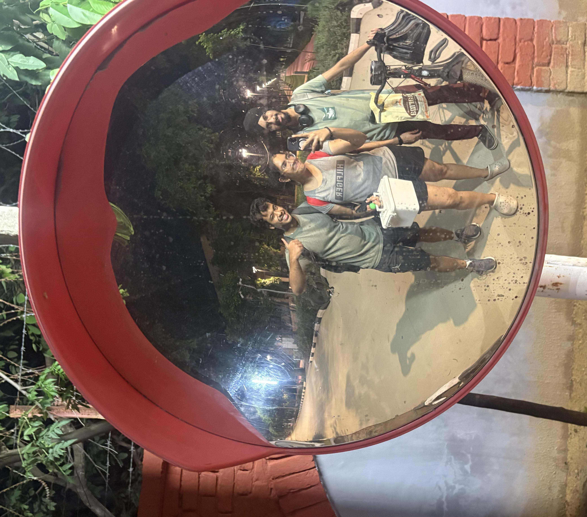<br><br> 

# 🎯 Challenge Overview
The Future Engineers Challenge for the 2026 WRO season involves designing and building an autonomous vehicle capable of completing two competition challenges.

The first challenge is the Open Challenge. In this challenge, the robot must autonomously complete three laps around the field while navigating between the outer boundary walls and the randomly positioned inner walls. The robot must maintain reliable navigation despite variations in the field layout and changing driving directions.

The second challenge is the Obstacle Challenge. In this challenge, red and green traffic signs are placed along the course. The robot must complete three laps while passing red traffic signs on the left side and green traffic signs on the right side. The robot must accurately detect the driving direction, avoid collisions, navigate around obstacles, and finish by parking within the designated parking area. The wall placement is fixed for this challenge.

Throughout the season, our goal is to develop a robot that combines reliable hardware, efficient software, and robust autonomous navigation. To prepare for possible surprise-rule modifications, our software is designed with a modular architecture that allows competition-specific parameters and behaviours to be adjusted quickly without major changes to the core navigation system.

## 🚀 Open Challenge

**Objective:** Complete three autonomous laps on dynamically configured tracks.

| Aspect | Challenge | Our Solution |
|:---:|:---|:---|
| **Track Variability** | Random internal wall placements | Adaptive path planning algorithms |
| **Navigation** | Unknown track layouts each round | Robust wall-following with corner detection |
| **Performance** | Consistent lap times across variations | Optimized PID control and sensor fusion |
| **Precision** | Maintain course in narrow lanes | High-accuracy steering and speed control |

---

## 🚧 Obstacle Challenge

**Objective:** Navigate three laps with traffic sign compliance and precision parking.

| Challenge Element | Requirement | Our Implementation |
|:---:|:---|:---|
| **Traffic Signs** | Red → Right side<br>Green → Left side | Real-time color detection with OpenCV |
| **Obstacle Avoidance** | Avoid collision with obstacles | ToF sensors + computer vision fusion |
| **Navigation** | Follow fixed track layout | Hybrid wall-following and landmark detection |
| **Parking** | Park in designated area | Precision control with hard coded movements with help of encoder |
| **Performance** | Complete 3 laps reliably | Optimized speed profile and decision making |

# 📁 Documentation Evaluation Framework

## 📊 WRO 2026 Engineering Documentation

| Area | Our Documentation Coverage |
|:---|:---|
| **1. Mobility Management** | Complete mechanical design, drivetrain, motor selection, steering system, differential and assembly documentation |
| **2. Power & Sensor Management** | Battery system, voltage regulation, sensor integration, wiring diagrams and component specifications |
| **3. Obstacle Management** | Computer vision, ToF-based obstacle detection, traffic-sign handling and autonomous navigation algorithms |
| **4. Team & Robot Documentation** | Team profiles, robot photographs, component photographs and labeled system documentation |
| **5. GitHub Utilization** | Structured repository, version control, source code organization, documentation and regular commits |
| **6. Engineering & Innovation** | Modified RC chassis, custom N20 drivetrain integration, custom electronics architecture and engineering decisions |
| **7. Overall Presentation** | Clear technical communication, organized documentation and information that enables understanding and replication |
| **Total Documentation Score** | **Complete technical documentation of the Astra autonomous vehicle** |

# 🤖 Our Robot

| Front View | Back View | Left View |
|:---:|:---:|:---:|
| 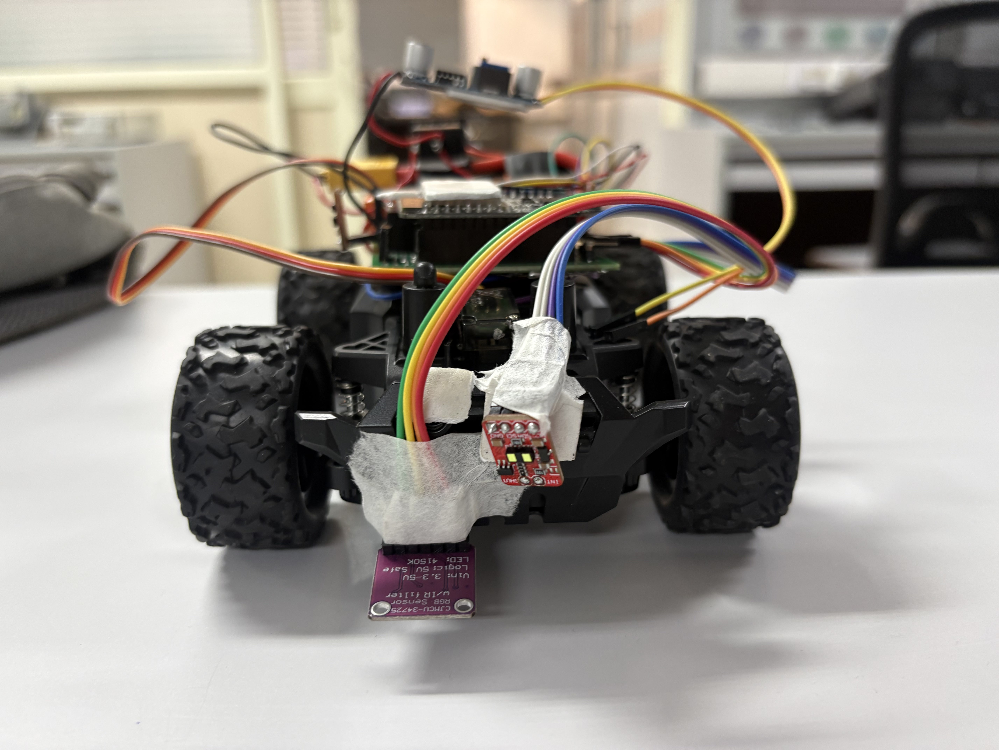 | 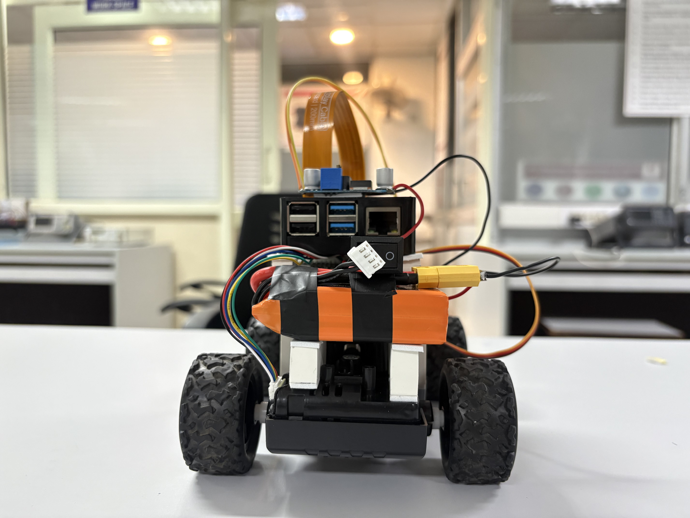 | 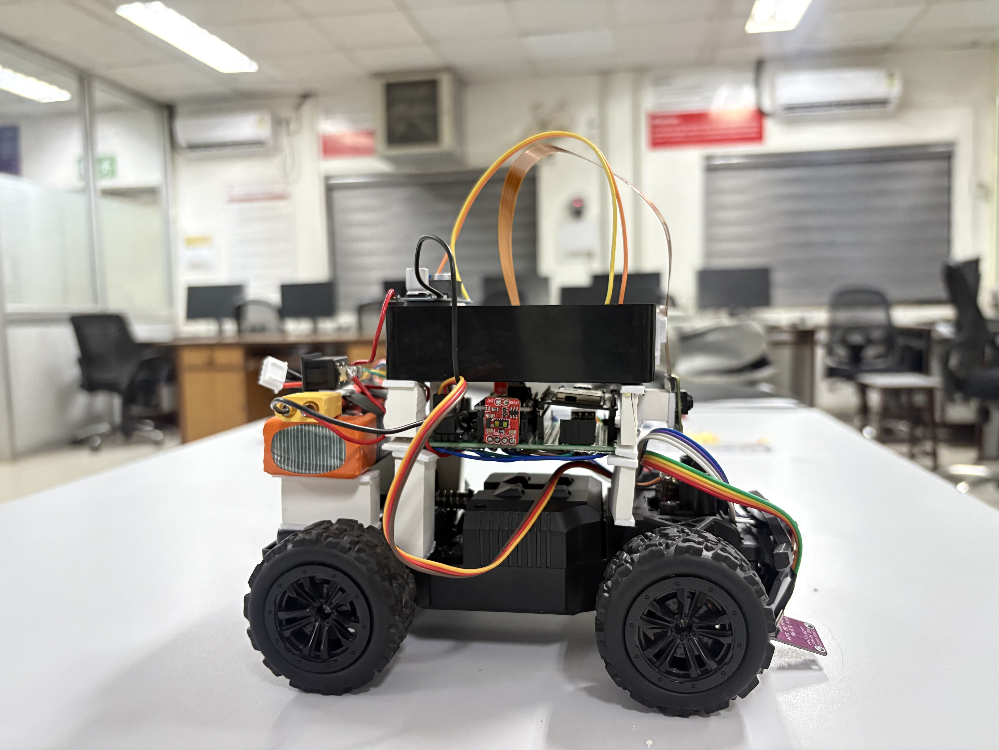 |

| Right View | Top View | Bottom View |
|:---:|:---:|:---:|
| 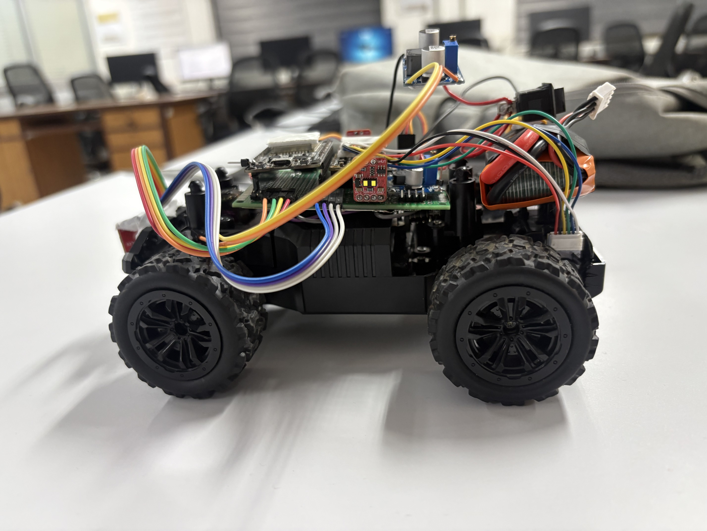 | 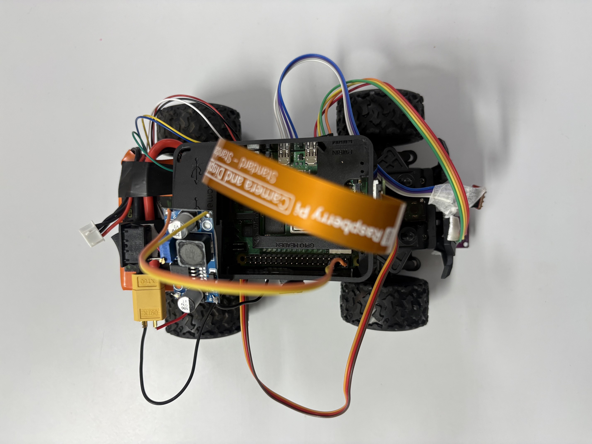 | 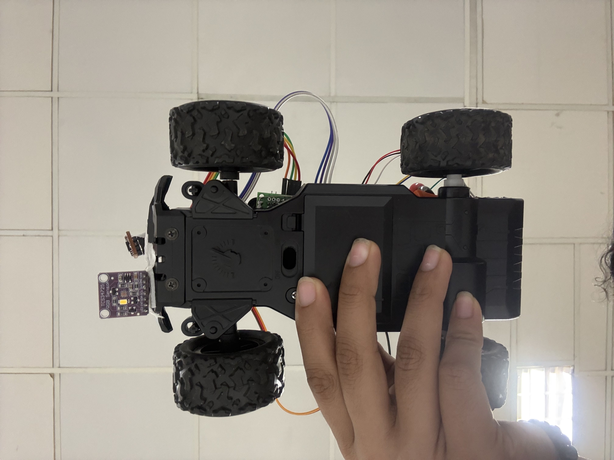 |

# 🔧 Electronic Systems
Our electronics are engineered to provide fast sensor feedback, stable power distribution, and precise control, enabling consistent performance during autonomous navigation.


| Component | Image | Quantity | Function | Key Specifications |
|:---------:|:-----:|:--------:|:--------:|:------------------:|
| **compute module 5** | 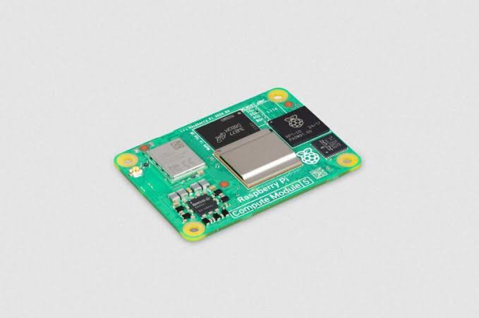 | 1 | Vision Processing | Dual-core Cortex-M7/M4<br>Camera Interface |
| **Rpi Pico** | 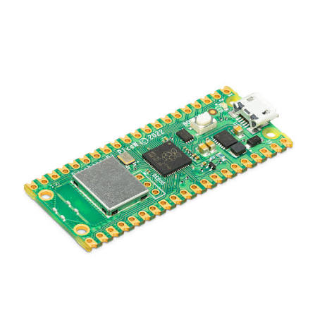 | 1 | Sensor Fusion | Multi-protocol wireless MCU |
| **Rpi cam 1.3 OV5647** | 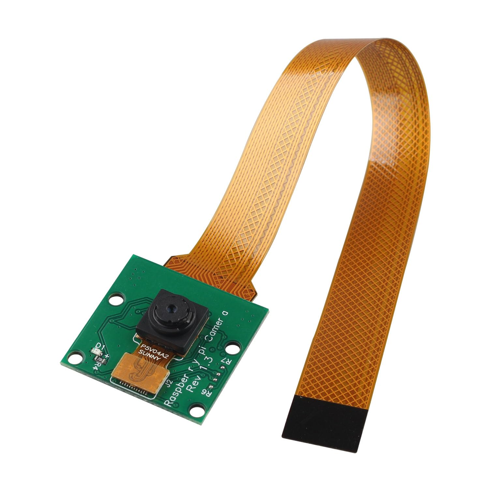 | 1 | Visual Navigation | 5 MP Resolution |
| **VL53L1X ToF** | 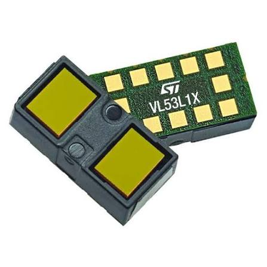 | 3 | Side Detection | Up to 4 m Range, FoV |
| **VL53LoX ToF** | 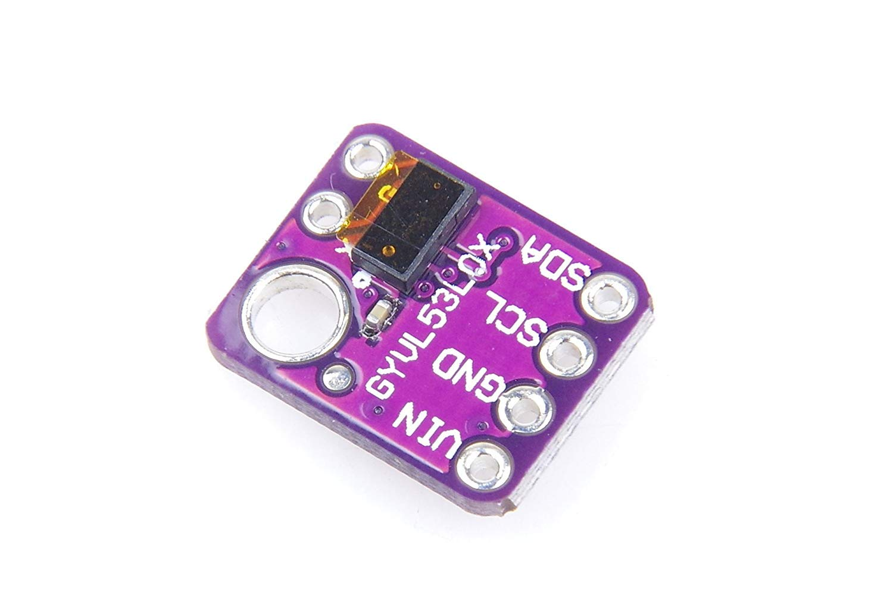 | 1 | Side Detection | Up to 3 m Range, FoV |
| **TB6612FNG driver** |  | 1 | Motor control | Dual H-Bridge 1.2 A Continuous |
| **Tower Pro MG90** |  | 1 | Steering Action | Micro servo motor for precision and control |
| **1000 RPM N20** |  | 1 | Robot Locomotion | Brushed DC with hall effect encoder |
| **3S lipo 1000mah 30C** | 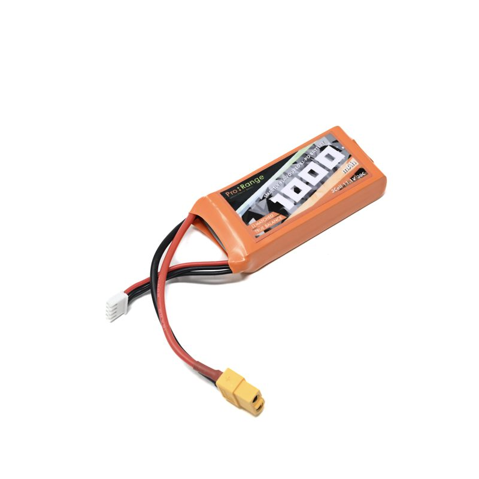 | 1 | Power Source | 1000 mah lipo with protection circuit |
| **BNO055 imu** |  | 1 | motion tracking | 6-axis inertial measurement |
| **TCS34725** |  | 1 | line detection | colour sensor pair for line detection |
| **SPST switch** | 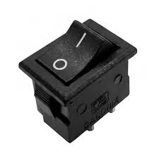 | 1 | power switch | on/off switch for power |

Components were selected based on performance, reliability, power efficiency, and compatibility. Preference was given to lightweight, readily available, and well-supported hardware that ensures seamless integration, accurate operation, and dependable performance in competitive robotics applications.

### Iteration 2
| Component | Image | Quantity | Function | Key Specifications |
|:---------:|:-----:|:--------:|:--------:|:------------------:|
| **Rpi 4** | 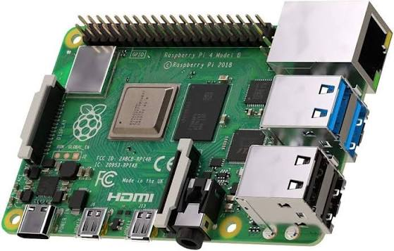 | 1 | Vision Processing | Dual-core Cortex-M7/M4<br>Camera Interface |
| **ESP32** | 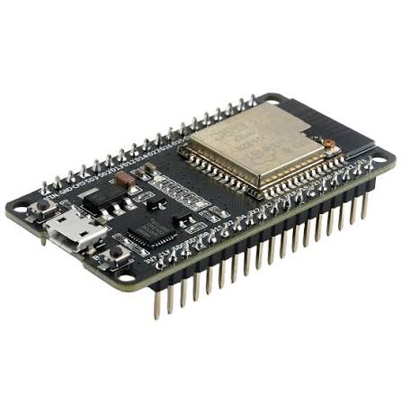 | 1 | Sensor Fusion | Multi-protocol wireless MCU |

These components were peplaced due to difficulties faced during testing. ESP32 was finally chosen over pico due to the ease of use as serial communication of pico was not realiable and we had inbuilt wifi and bluetooth in esp for testing drivetrain. Rpi 4 was selected due to ease of use and easir intergration and testing.


## 🔋 Power Consumption Breakdown

The table below summarizes the typical and peak current consumption and estimated power requirements of the major components used in our robot.

| Component | Voltage | Typical Current | Peak Current | Power Consumption |
|:---|:---:|---:|---:|---:|
| **Compute Module 5 (CM5)** | 5V | ~1 A | ~3 A | ~3 W – 7.5 W |
| **Raspberry Pi Pico 2** | 5V | ~25 mA | ~50 mA | ~125 mW – 250 mW |
| **Rpi cam 1.3 OV564** | 5V | ~200 mA | ~500 mA | ~1 W – 1.25 W |
| **VL53L1X ToF (×3)** | 3.3V | ~20 mA each | ~40 mA each | ~198 mW – 396 mW |
| **VL53L0X ToF (×1)** | 3.3V | ~20 mA each | ~40 mA each | ~198 mW – 396 mW |
| **BNO055 IMU** | 3.3V | ~12 mA | ~15 mA | ~40 mW – 50 mW |
| **Color Sensor** | 3.3V | ~20 mA | ~50 mA | ~66 mW – 165 mW |
| **TB6612FNG Motor Driver** | 5V | ~1 mA | ~3 mA | ~3.3 mW – 10 mW |
| **MG90 Servo** | 5V | ~100 mA | ~650 mA | ~500 mW – 3.25 W |
| **N20 Encoder Motor** | 5V | ~150 mA | ~1 A | ~0.9 W – 6 W |
| **Main Power System** | 11.1V | — | — | Depends on load |
| **Total System** | Mixed | **~1.2 A** | **~4.4 A** | **~8.5 W – 20 W** |

### After Iteration 
| Component | Voltage | Typical Current | Peak Current | Power Consumption |
|:---|:---:|---:|---:|---:|
| **Raspberry Pi 4** | 5V | ~1 A | ~3 A | ~3 W – 7.5 W |
| **ESP32** | 3.3V | ~25 mA | ~50 mA | ~125 mW – 250 mW |


## E.1 System Overview

The electronics platform is built around a two-controller architecture: a **Raspberry Pi Compute Module 5 (CM5)** handling all high-level autonomy, and a **Raspberry Pi Pico 2** dedicated to real-time, low-level hardware control. This split exists because the two workloads have fundamentally different timing requirements. Vision processing, path planning, and decision logic are computationally heavy but tolerant of small latency variations; motor control, encoder counting, and IMU polling are computationally light but require tight, deterministic timing to avoid jitter in control loops. Running both on a single Linux-based board risks non-deterministic delays in the control loop caused by OS scheduling, so the two responsibilities were separated onto hardware suited to each.
Later changed with **Raspberry Pi 4** and **ESP32** due to reasons mentioned above.

<p align="center">
  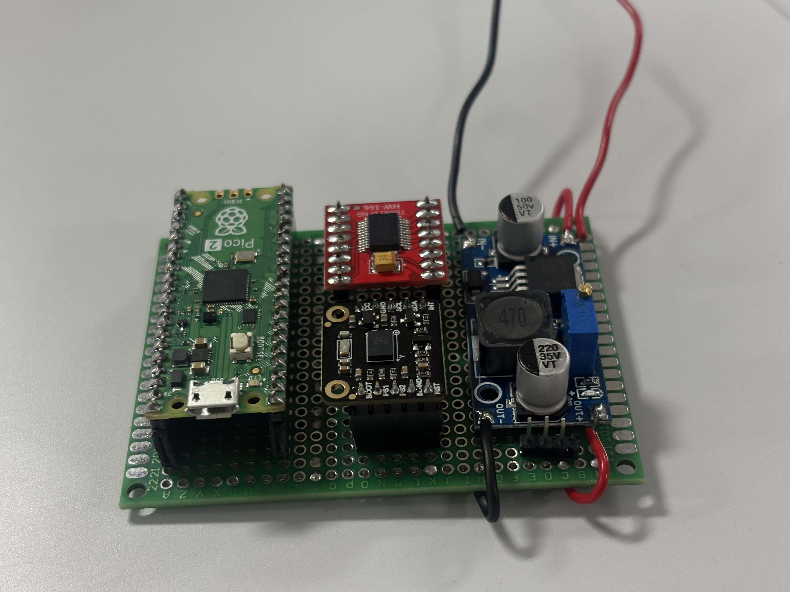
</p>

<p align="center">
  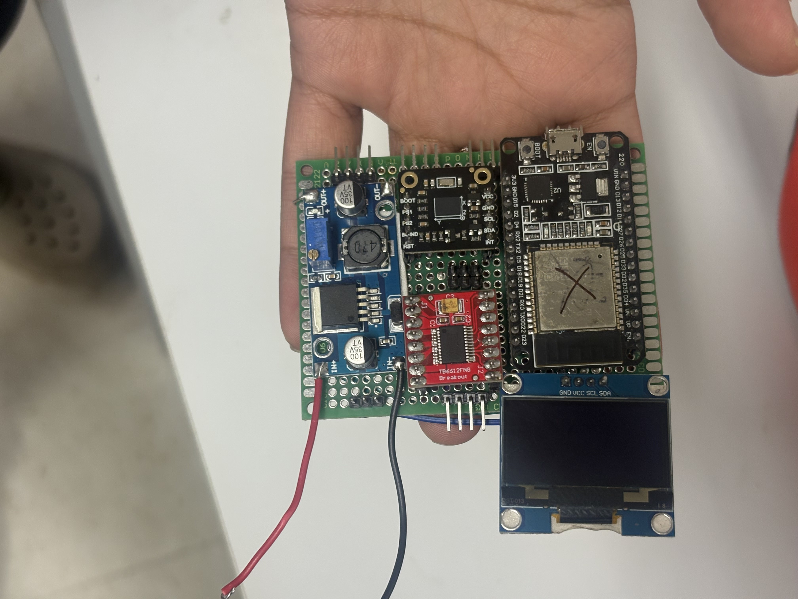
</p>

### Role of the Compute Module 5

The CM5 runs the full autonomy stack:

- Camera-based vision processing for lane and obstacle detection
- Path planning and navigation logic
- High-level strategy and decision-making (e.g., when to stop, which maneuver to execute)
- Sending high-level motion commands (target speed, target steering angle) to the Pico

<p align="center">
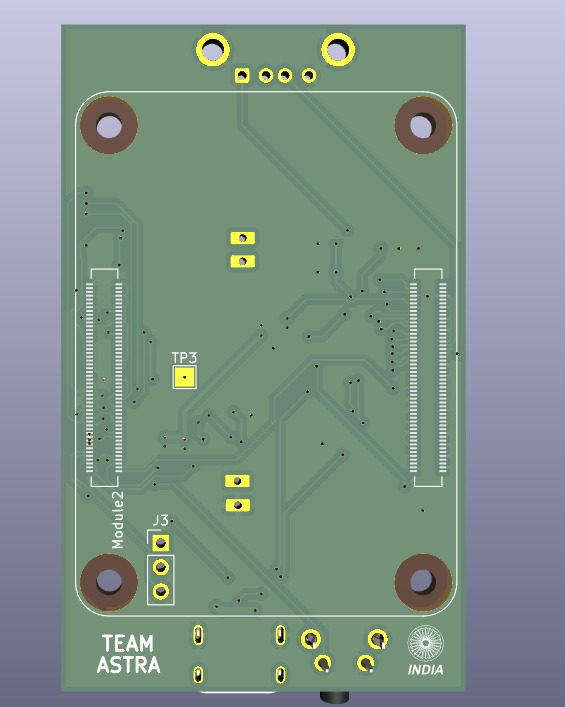
</p>
<p align="center">
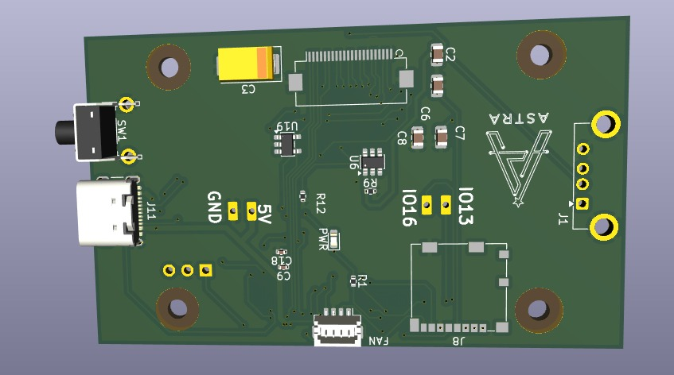
</p>

### Role of the Raspberry Pi Pico 2

The Pico acts as the robot's real-time I/O layer:

- Generating PWM signals for the drive motor and reading quadrature encoder pulses
- Driving the steering servo
- Polling the IMU for orientation data
- Managing the three Time-of-Flight distance sensors, including their XSHUT lines for I2C address assignment
- Reading the color sensor
- Streaming sensor data to the CM5 and executing motion commands received from it

Because the Pico runs bare-metal (no OS scheduling overhead), it can service sensor reads and motor control loops at consistent, predictable intervals — something that is difficult to guarantee on a general-purpose Linux system under simultaneous vision-processing load.

<p align="center">
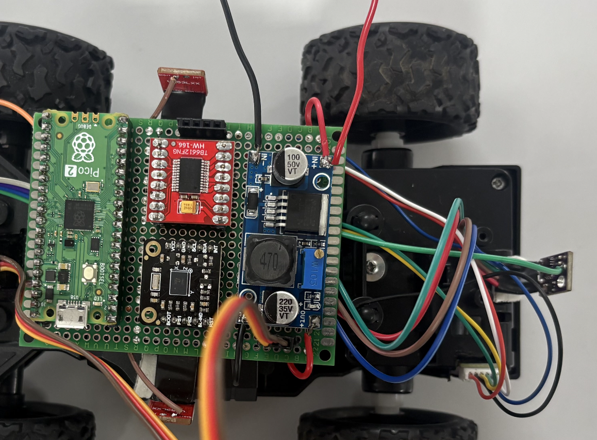
<p>

### After Iteration
### Role of the Raspberry Pi 4

The Raspberry Pi 4 acts as the robot's high-level compute and autonomy layer:

- Camera-based vision processing for lane and obstacle detection
- Image processing and extraction of object positions
- Path planning and navigation logic
- High-level strategy and decision-making
- Deciding when to stop, turn, or execute a particular maneuver
- Generating target motion commands such as target speed and steering angle
- Sending high-level motion commands to the ESP32 through serial communication

<p align="center">
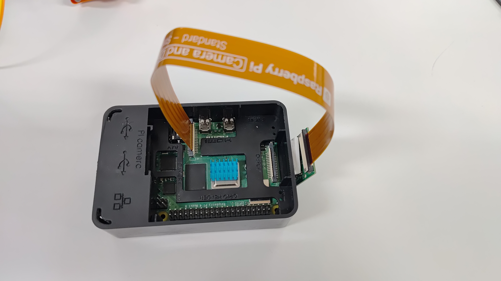
<p>

### Role of the ESP32

The ESP32 acts as the robot's real-time control and hardware interface layer:

- Generating PWM signals for the drive motors
- Reading quadrature encoder pulses for wheel feedback
- Controlling the steering servo
- Reading the IMU for orientation and motion feedback
- Reading the three Time-of-Flight distance sensors for obstacle and wall detection
- Managing the XSHUT lines of the ToF sensors for I²C address assignment
- Executing low-level motor and steering commands received from the Raspberry Pi 4
- Sending sensor and encoder feedback back to the Raspberry Pi 4

<p align="center">
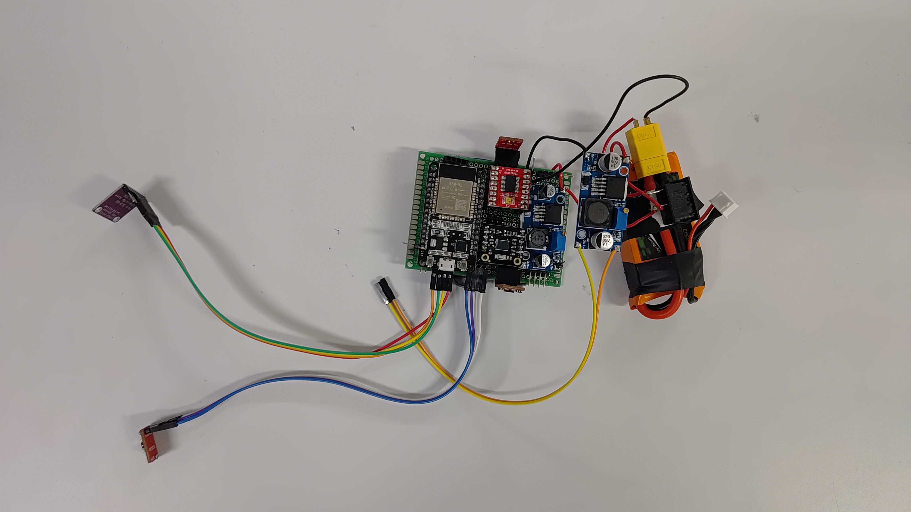
<p>

### System Architecture

```text
Camera
   |
   v
Raspberry Pi 4
   |
   |-- Vision Processing
   |-- Path Planning
   |-- Navigation
   |-- High-Level Decisions
   |
   |-- Serial Communication
   |
   v
ESP32
   |
   |-- Motor PWM
   |-- Encoder Feedback
   |-- Steering Servo
   |-- IMU
   |-- ToF Distance Sensors
   |
   v
Motors & Steering
```

## E.2 Why UART Communication

UART was selected as the link between the RPi 4 and the ESP32 over alternatives such as I2C, SPI, or USB serial for a few practical reasons:

- **Simplicity and reliability** — UART requires only two data lines (TX/RX) with no clock signal or bus arbitration, reducing the chance of communication faults during a physically vibrating robot.
- **Sufficient bandwidth** — the data exchanged (motion commands from Rpi 4, sensor telemetry from ESP32) is small and infrequent enough that UART's throughput is not a bottleneck.
- **Independent, asynchronous operation** — UART does not require a shared clock, so the Rpi 4 and ESP32 can run their own independent loop timings without one blocking the other.
- **Native hardware support** — both the Rpi 4 and the ESP32 expose dedicated UART peripherals, avoiding the need for software-bit-banged protocols that would compete with other GPIO tasks.

## E.3 PCB Design

Two separate boards carry the electronics, built with two different approaches depending on what each one needed to do:

1. **Pico peripheral board (hand-soldered perfboard)** — a hand-soldered board built on a generic prototyping ("zero") PCB, populated with the Raspberry Pi Pico, the TB6612FNG motor driver, and headers for the IMU, the three ToF sensors, the color sensor, and the encoder. Since this board only needed to route low-speed I2C, GPIO, and PWM signals over short distances, hand-soldering on perfboard was fast to iterate on and easy to rework during development, without needing a full PCB fabrication turnaround every time a connection changed.
2. **CM5 carrier board (designed PCB)** — a properly designed and routed board built specifically for the Raspberry Pi Compute Module 5. Because the CM5 requires correctly routed high-density board-to-board connectors, this board could not realistically be hand-soldered; it was laid out with all the necessary routing for the CM5 itself, along with the UART pins and power connections needed to interface with the Pico board.

<!-- IMAGE: Top-down photo of the routed CM5 carrier PCB -->
[CM5 Carrier PCB](other/cm5-carrier-board-front.jpg)

<!-- IMAGE: Top-down photo of the hand-soldered Pico/ToF perfboard -->
[Pico Peripheral PCB](other/pico-peripheral-board.jpg)

Splitting the electronics this way matched the fabrication method to what each board actually required: the CM5's connector demands a properly designed and routed PCB, while the Pico's simpler, lower-density I/O was well suited to a hand-soldered board that could be modified quickly during development. Consolidating the low-level wiring onto the single Pico perfboard rather than routing individual jumper wires across the chassis still reduces the number of loose connections that can vibrate free during a run and makes it easier to trace a fault to a specific header rather than a tangle of point-to-point wires.

## E.4 Battery

| Spec | Value |
|---|---|
| Chemistry | 3S LiPo |
| Capacity | 1000 mAh |

[Battery LiPo 1000 Mah](other/battery.jpg)

A 3S (11.1V nominal) LiPo pack was selected to supply sufficient voltage headroom for the motor driver and drive motor without needing a boost converter, while the 1000 mAh capacity keeps the pack physically small and light — important given that battery weight sits near the chassis center and directly affects handling and acceleration. LiPo chemistry was chosen over NiMH or alkaline alternatives for its high discharge current capability, which suits the bursty current demand of a drive motor accelerating and braking repeatedly through a run, and for its favorable energy-to-weight ratio compared to other rechargeable chemistries.

## E.5 Sensors

### IMU — BNO055

The BNO055 is a 9-axis absolute orientation sensor with onboard sensor fusion, used here to provide:

- **Heading** — a stable yaw reference for maintaining and correcting the robot's direction of travel between turns
- **Orientation and rotation tracking** — supporting the navigation stack's estimate of the robot's pose on the track
- **Stabilization feedback** — helping detect and correct unintended drift or rotation that pure wheel-encoder odometry would miss, particularly during wheel slip

Because the BNO055 performs sensor fusion on-chip, the Pico receives a stable orientation estimate directly over I2C rather than needing to fuse raw accelerometer/gyroscope data itself, which keeps the Pico's control loop lightweight.

[IMU BNO055](other/IMU_BNO055.jpeg)

### Distance Sensors — VL53L1X (×3)

Three VL53L1X Time-of-Flight sensors are used for spatial awareness:

- **Front-facing sensor** — detects walls or obstacles directly ahead, used for stopping distance and forward obstacle avoidance
- **Two side-facing sensors** — detect the left and right track walls, allowing the robot to maintain a centered position within the lane and detect upcoming turns before they are visible to the camera

Since all three VL53L1X units share the same default I2C address, each sensor's XSHUT pin is wired to a separate Pico GPIO. On startup, the Pico holds all three sensors in reset, brings them up one at a time, and assigns each a unique I2C address before releasing the next — a standard technique for running multiple identical I2C ToF sensors on one bus.


[VL53L1X ToF Sensor Placement](other/vl53l1x.jpg)

### Color Sensor

A single color sensor is included for surface and marker detection where the challenge requires distinguishing track features (such as colored lane markers or parking zone indicators) that distance sensing alone cannot resolve.

<!-- IMAGE: Color sensor module and its mounting location -->
[Color Sensor](other/colour_sensor.jpg)

## E.6 Motor Driver — TB6612FNG

The TB6612FNG dual H-bridge driver was selected over older driver ICs such as the L298N for several practical advantages:

- **Higher efficiency** — the TB6612FNG uses MOSFET switching rather than the L298N's bipolar transistor output stage, which significantly reduces voltage drop and heat generation, translating to more usable torque from the same battery voltage.
- **Smaller footprint** — better suited to a compact custom PCB layout than the physically larger L298N breakout modules.
- **Standby control** — the STBY pin allows the driver to be fully disabled in software, useful for an emergency-stop condition without cutting power to the rest of the electronics.

<!-- IMAGE: TB6612FNG motor driver mounted on the Pico peripheral PCB -->
[TB6612FNG Motor Driver](other/motor_driver.png)

## E.7 GPIO Connections

| Subsystem | Signal | Pico GPIO |
|---|---|---|
| Motor Driver | PWMB | GPIO27 |
| Motor Driver | BIN2 | GPIO12 |
| Motor Driver | BIN1 | GPIO14 |
| Motor Driver | STBY | GPIO13 |
| Motor Driver | Encoder A | GPIO34 |
| Motor Driver | Encoder B | GPIO35 |
| Servo | Signal | GPIO26 |
| IMU (BNO055) | SDA | GPIO21 |
| IMU (BNO055) | SCL | GPIO22 |
| ToF Sensors | SDA | GPIO33 |
| ToF Sensors | SCL | GPIO32 |
| ToF Sensor 1 | XSHUT1 | GPIO15 |
| ToF Sensor 2 | XSHUT2 | GPIO18 |
| ToF Sensor 3 | XSHUT3 | GPIO19 |
| OLED (Optional) | SDA | GPIO21 |
| OLED (Optional) | SCL | GPIO22 |
| Color Sensor | SDA | GPIO21 |
| Color Sensor | SCL | GPIO22 |
| Power | 3.3V | — |
| Power | 5V | — |
| Power | GND | — |

<!-- IMAGE: Full wiring overview showing all connections from the Pico PCB to sensors, motor driver, and servo -->
[Full Wiring Overview](other/all_wiring.jpg)

## E.8 System Architecture

### Block Diagram

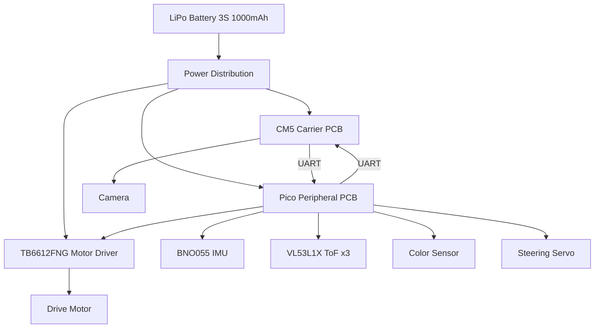
```mermaid
graph TD
    A[LiPo Battery 3S 1000mAh] --> B[Power Distribution]
    B --> C[CM5 Carrier PCB]
    B --> D[Pico Peripheral PCB]
    B --> E[TB6612FNG Motor Driver]

    C -->|UART| D
    D -->|UART| C

    D --> F[BNO055 IMU]
    D --> G[VL53L1X ToF x3]
    D --> H[Color Sensor]
    D --> E
    E --> I[Drive Motor]
    D --> J[Steering Servo]

    C --> K[Camera]
```


### Power Distribution Diagram

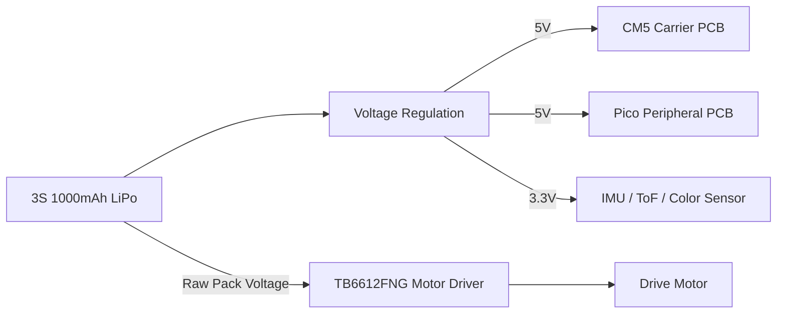
```mermaid
graph LR
    BAT[3S 1000mAh LiPo] --> REG[Voltage Regulation]
    REG -->|5V| CM5PWR[CM5 Carrier PCB]
    REG -->|5V| PICOPWR[Pico Peripheral PCB]
    REG -->|3.3V| SENSPWR[IMU / ToF / Color Sensor]
    BAT -->|Raw Pack Voltage| DRV[TB6612FNG Motor Driver]
    DRV --> MOTOR[Drive Motor]
```

### Sensor Architecture Diagram

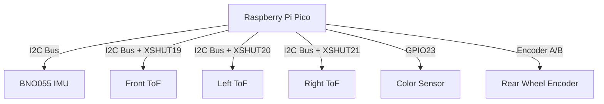
```mermaid
graph TD
    PICO[Raspberry Pi Pico] -->|I2C Bus| IMU[BNO055 IMU]
    PICO -->|I2C Bus + XSHUT19| TOF1[Front ToF]
    PICO -->|I2C Bus + XSHUT20| TOF2[Left ToF]
    PICO -->|I2C Bus + XSHUT21| TOF3[Right ToF]
    PICO -->|GPIO23| COLOR[Color Sensor]
    PICO -->|Encoder A/B| ENC[Rear Wheel Encoder]
```

### Drivetrain Overview

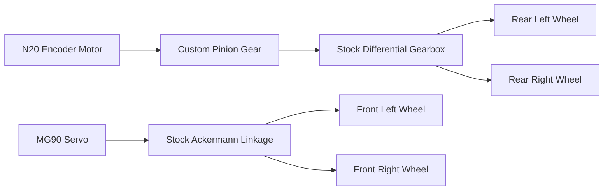
```mermaid
graph LR
    MOTOR[N20 Encoder Motor] --> PIN[Custom Pinion Gear]
    PIN --> DIFF[Stock Differential Gearbox]
    DIFF --> WHEEL_L[Rear Left Wheel]
    DIFF --> WHEEL_R[Rear Right Wheel]
    SERVO[MG90 Servo] --> LINK[Stock Ackermann Linkage]
    LINK --> FWHEEL_L[Front Left Wheel]
    LINK --> FWHEEL_R[Front Right Wheel]
```

### Full Data Flow

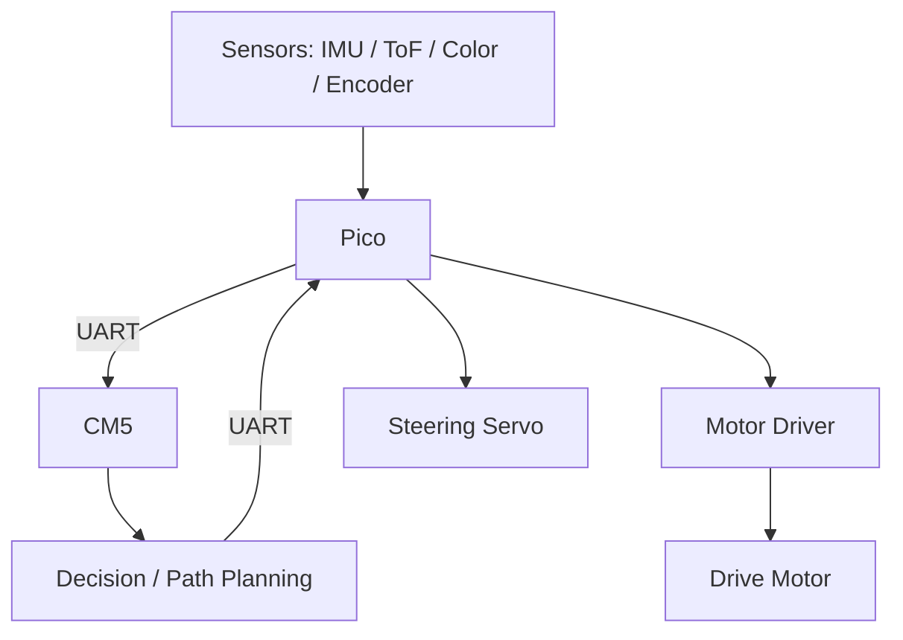
```mermaid
flowchart TD
    S[Sensors: IMU / ToF / Color / Encoder] --> P[Pico]
    P -->|UART| C[CM5]
    C --> DEC[Decision / Path Planning]
    DEC -->|UART| P
    P --> MD[Motor Driver]
    MD --> M[Drive Motor]
    P --> SV[Steering Servo]
```
<a name="mechanical-systems"></a>

# ⚙️ Mechanical Systems

## M.1 Design Philosophy

Rather than designing a chassis from scratch, the mechanical platform starts from a donor RC car chassis. This decision was made deliberately, not out of convenience alone: a mass-produced RC car chassis has already gone through iterative engineering for exactly the mechanical problem this competition poses — a four-wheeled, front-steered, rear-driven vehicle with a differential drive system and Ackermann-geometry front steering. Reverse-engineering that geometry from zero would have consumed development time better spent on the software and electronics stack, so the base chassis, differential, and steering knuckle geometry were retained and everything else was rebuilt around them.

The chassis was stripped down to its structural core, and every part not required for the competition — the original shell/body, the original electronics, the original steering servo, and the original drive motor — was removed. What remained was treated as a mechanical foundation to be customized: reinforced where needed, cut down where it was oversized, and rebuilt around a purpose-fit drivetrain and electronics package.

<!-- IMAGE: Full chassis overview (isometric / 3D render or photo) -->
[Chassis Overview](other/chassis-overview.jpg)

## M.2 Baseplate Construction — Modified RC Car Base

The baseplate is the original RC car chassis tub, modified to fit our own electronics and sensor layout. Sections of the stock plastic body and internal mounting bosses that were not structurally necessary were cut away to make room for the Compute Module 5 PCB, the Pico peripheral PCB, the battery, and the Motors we used, all of which were not part of the original RC car's layout and had no dedicated space on the stock chassis.

This approach kept the structural rigidity of a chassis that was already engineered to handle motor torque and steering loads, while freeing up the internal volume needed for our own hardware. Where the stock chassis lacked a mounting point for a new component, standoffs or brackets were added directly onto the existing plastic structure rather than replacing the chassis outright.

<!-- IMAGE: Bare, cut-down baseplate showing removed sections and new mounting points -->
[Baseplate Layout](other/baseplate-layout.jpg)

## M.3 Wheel Configuration

The robot retains the RC car's original four-wheel layout: two front wheels connected through the (retained) steering linkage, and two rear wheels driven through the (retained) differential. This is a conventional car-like Ackermann configuration rather than a skid-steer or omniwheel layout. Keeping the stock wheel and tire set meant the vehicle's rolling behavior — grip, tire scrub characteristics, and turning radius — stayed consistent with a platform that was already tuned by the manufacturer for stable car-like handling, which gave a reliable baseline to build the drivetrain and steering modifications on top of.

<!-- IMAGE: Close-up of wheel/tire assembly (front and rear) -->
[Wheel Configuration](other/wheel-config.jpg)

## M.4 Differential Gear Drive System

The stock differential gearbox from the RC car was kept in place, but the original drive motor was removed and replaced with an **N20 micro DC gear motor fitted with an encoder**, connected to the differential input through a custom pinion gear. The differential itself still performs its original mechanical function: it allows the inner and outer rear wheels to rotate at different speeds while cornering, so during a turn the outer wheel — which travels a longer arc than the inner wheel — is not forced to scrub or skip against the mat surface to keep pace with a rigid shared axle.

Switching to an N20 motor was necessary for two reasons:

1. **Encoder feedback** — the stock RC motor had no shaft encoder, and closed-loop speed/distance control is not possible without one. The N20 was selected specifically because encoder-equipped variants are widely available in a compact form factor that fits inside the existing chassis footprint.
2. **Controllability** — an N20 geared motor draws current in a range well suited to the TB6612FNG driver and gives finer low-speed control than the stock RC motor, which was tuned for RC-hobby throttle response rather than precise autonomous speed control.

Fitting the N20 motor required machining/printing a custom pinion gear sized to mesh correctly with the stock differential's ring gear, since the N20's shaft diameter and gear pitch do not match the original motor. The motor mount itself was adapted from the stock motor mount position, with material added or removed as needed to align the new pinion correctly with the differential.

<!-- IMAGE: Rear axle assembly showing the stock differential, N20 motor, and custom pinion gear -->
[Differential Drive System](other/differential-drive.jpeg)

## M.5 Ackermann Steering Mechanism

The front steering geometry — the steering knuckles, tie rods, and Ackermann arm angles — is the original geometry built into the donor RC car chassis, which already implements correct Ackermann geometry as standard for RC car handling. What was changed is the actuator: the stock steering was being controlled by Dc geared motor and it didnt provide us the modularity to control the steering angles so it was removed and replaced with an **MG90 micro servo**, mounted onto the existing steering linkage mounting point.

[Differential Drive System](other/servo-mount-for-steering.jpg)

Because the MG90 has different physical dimensions, spline pattern, and horn mounting compared to the original servo, the servo mount area required plastic to be cut away and re-shaped so the MG90 could sit flush and drive the stock steering arm directly. The horn linkage was re-fitted to the stock tie-rod pickup point so that the existing, already-correct Ackermann geometry was preserved — only the actuator driving it changed.

<!-- IMAGE: Front steering assembly close-up (MG90 servo mounted on the modified stock linkage) -->
[Ackermann Steering Linkage](other/ackermann-steering-linkage.jpg)

### Why This Approach Was Chosen

Building an Ackermann linkage from scratch means solving for steering arm angle, tie rod length, and kingpin geometry to get the inner and outer wheels tracking a common turn center without scrubbing — a problem that is easy to get subtly wrong. The donor chassis had already solved this problem as a manufactured product, so retaining the stock steering knuckles and swapping only the servo let the project keep correct, proven Ackermann geometry while spending engineering effort on the parts of the robot that actually needed to be original: the electronics, sensing, and control software.

<!-- IMAGE: Top-down diagram of Ackermann geometry showing wheel angles and common turn center -->
[Ackermann Steering Geometry Diagram](other/ackermann-diag.png)

### Advantages During Autonomous Driving

Because the underlying geometry is unchanged Ackermann geometry, the same benefits apply as in a from-scratch design:

- **Consistent turning radius** — wheel scrub is minimized, so the relationship between servo angle and actual turning radius stays predictable, which matters for open-loop or lightly-corrected path planning.
- **Better odometry** — the rear wheel encoder (on the N20 motor) stays accurate during turns since the driven wheels are not skidding, keeping distance and heading estimates reliable.
- **Lower mechanical wear and current draw** — no wheel is being dragged sideways, which keeps motor load and battery draw lower through turn-heavy sections of the track.
- **Repeatability** — the same MG90 servo angle reliably produces the same turning radius run after run, since it drives geometry that was manufactured to a fixed, proven tolerance rather than a hand-built linkage.

## M.6 Weight Distribution and Component Placement

Heavier components — the battery and the Compute Module 5 PCB — are mounted low and toward the center of the chassis, keeping the center of gravity low and weight biased toward the driven wheels for better rear traction under acceleration. The front of the chassis, where plastic was cut away around the MG90 servo, is kept as light as possible so the servo has less mass to move when steering, which improves steering response time.

*Assumption: no exact measured weight distribution figures were provided; the description above reflects placement intent based on the modified chassis layout rather than measured values.*

<!-- IMAGE: Top-down annotated photo showing component placement zones on the modified chassis (battery, RPi4, servo, sensors) -->
[Component Placement](other/placement.jpg)

## M.7 Maintainability and Ease of Assembly

Because the platform is built on a modified RC car chassis rather than a fully custom frame, most structural spare parts (wheels, differential internals, steering knuckles) are standard RC hobby parts and can be sourced or swapped quickly if damaged. The custom-fitted parts — the N20 motor/pinion assembly, the MG90 servo mount, and the electronics trays — were each cut and mounted as a distinct, separable modification rather than being permanently bonded to the chassis, so any one of them can be reworked or replaced without affecting the others.


## M.8 Engineering Decisions and Tradeoffs

| Decision | Alternative Considered | Reason Chosen |
|---|---|---|
| Modified RC car chassis as base | Fully custom-built chassis | Reuses proven Ackermann geometry and differential; saves development time for electronics/software |
| N20 encoder motor + custom pinion | Keeping the stock RC drive motor | Stock motor has no encoder feedback; N20 enables closed-loop speed/distance control |
| MG90 servo on stock linkage | Custom steering linkage | Preserves proven Ackermann geometry while enabling microcontroller-driven steering |
| Cutting chassis plastic to fit components | Designing a new enclosure from scratch | Faster to implement; keeps the chassis's existing structural strength |

## M.9 Future Improvements

- Design a custom pinion/motor mount with tighter tolerances to reduce any gear backlash introduced by adapting the N20 to the stock differential.
- Evaluate a stronger or higher-torque servo if the cut-down mounting area is found to flex the MG90 mount under load.
- Refine weight distribution empirically using a scale under each wheel rather than relying on placement intuition alone.
- Consider 3D-printing a reinforced replacement for the sections of stock plastic that were cut away, to restore some of the structural material removed during modification.

---


# 💻 Software Architecture

### Obstacle challenge code overview:

```text
Divides the camera frame into 4 different sections
                         ↓
                         ↓
Detects the position of the coloured object
                         ↓
                         ↓
Adjusts the bot so the inner edge aligns with the line
                         ↓
                         ↓
Sends movement signals from Raspberry Pi to ESP32
                         ↓
                         ↓
Uses hard-coded movements to pass around the object
                         ↓
                         ↓
Returns to line-following after passing the object
                         ↓
                         ↓
Uses camera-based PID control for the next colour detection
```
                

### To chose the object which is nearer to bot:

```text
    # ---------- Choose Closest Object ----------
    # Largest area = closest object

    target = None

    if red and green:

        target = (
            red
            if red["area"] > green["area"]
            else green
        )

    elif red:

        target = red

    elif green:

        target = green
```
### Open Challenge code overview:

```text
Detects the first coloured crossing
              ↓
              ↓
Determines the driving direction
              ↓
              ↓
Selects the inner wall to follow
              ↓
              ↓
Uses side ToF sensors to measure wall distance
              ↓
              ↓
Adjusts the bot using wall-following PID
              ↓
              ↓
Uses front ToF to detect upcoming corners
              ↓
              ↓
Uses BNO055 heading to execute controlled 90° turns
              ↓
              ↓
Continues hugging the selected inner wall
              ↓
              ↓
Detects the lap marker using the colour sensor
              ↓
              ↓
Validates lap using encoder distance
              ↓
              ↓
Increments lap counter
              ↓
              ↓
Repeats until 3 laps are completed
              ↓
              ↓
Stops the robot automatically
```

# 🎥 Performance Videos

Demonstration of the OpenCV-based vision system used for real-time camera processing and object/lane detection


Demonstration of serial communication between the Raspberry Pi 4 and ESP32 for sending control commands and receiving feedback


Development vlog showing the robot's construction, electronics integration, testing, and overall development process


Demonstration of the robot navigating the open challenge using its vision, navigation, and control systems


Demonstration of the robot detecting and navigating around obstacles using its sensors and autonomous control system


<div align="center">

<a href="https://www.youtube.com/watch?v=2e-6Fy21VAs">
  
</a>

</div>
