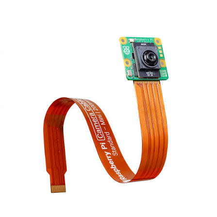
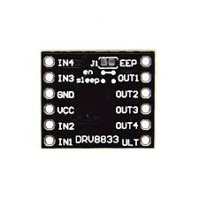
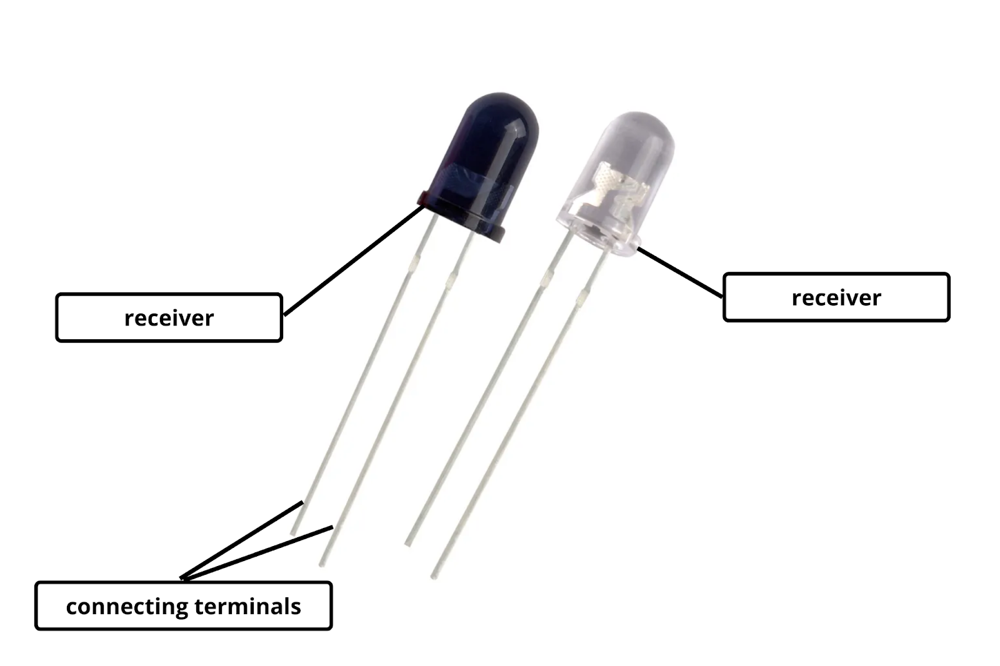

# WRO Future Engineers 2026 - Astra

  

> "An autonomous vehicle designed for the Future Engineers category of the WRO 2026 that uses advanced computer vision and IMU sensors to navigate complex environments and avoid obstacles intelligently."

# 📚 Table of Contents

- 📂 [Complete Documentation Structure](#-complete-documentation-structure)
- 👥 [The Team](#-the-team)
- 🎯 [Challenge Overview](#-challenge-overview)
- 🤖 [Our Robot](#-our-robot)
- 🔧 [Electronic Systems](#-electronic-systems)
- ⚙️ [Mechanical Systems](#-mechanical-systems)
- 💻 [Software Architecture](#-software-architecture)
- 📹 [Performance Videos](#-performance-videos)

# 📁 Complete Documentation Structure
| 📁 Folder | 🎯 Technical Content | 📖 Detailed Documentation |
|:---------:|:--------------------|:-------------------------:|
| 📊 **MATLAB** | **Vision System Calibration** • LAB colorspace analysis • Threshold optimization • Lighting condition testing | 🔗 [Explore MATLAB Documentation](MATLAB/README.md) |
| ⚙️ **Models** | **Mechanical Engineering** • 3D CAD designs • Assembly instructions • Gear system calculations | 🔗 [Explore 3D Models & Assembly Documentation](Models/README.md) |
| 🔌 **Schemes** | **Electrical Systems** • Wiring diagrams • Power management • Component schematics & datasheets | 🔗 [Explore Schematics & Wiring Documentation](Schemes/README.md) |
| 💾 **Source Code** | **Software Algorithms** • Navigation logic • Sensor fusion • Control systems | 🔗 [Explore Software & Algorithms Documentation](Source_Code/README.md) |
| 👥 **Team Photos** | **Team Documentation** • Member profiles • Development journey • Competition preparation | 🔗 [Explore Team Photos Documentation](Team_Photos/README.md) |

# 👥 The Team
## Team Introduction & Team Information

<table align="center">
<tr>
<td align="center" width="33%">

  

### DEVANSHI MALERI
**Captain**

*Planning • Logic • Electronics*

</td>

<td align="center" width="33%">

  

### BHAVDEEP SINGH
**Hardware Engineer**

*Wiring • Circuit Design • Power Management*

</td>

<td align="center" width="33%">

  

### VISHESH VIJ
**Lead Programmer**

*Sensor Integration • OpenCV • Obstacle Avoidance*

</td>
</tr>
</table>

# 🎯 Challenge Overview
The Future Engineers Challenge for the 2026 WRO season involves designing and building an autonomous vehicle capable of completing two competition challenges.

The first challenge is the Open Challenge. In this challenge, the robot must autonomously complete three laps around the field while navigating between the outer boundary walls and the randomly positioned inner walls. The robot must maintain reliable navigation despite variations in the field layout and changing driving directions.

The second challenge is the Obstacle Challenge. In this challenge, red and green traffic signs are placed along the course. The robot must complete three laps while passing red traffic signs on the left side and green traffic signs on the right side. The robot must accurately detect the driving direction, avoid collisions, navigate around obstacles, and finish by parking within the designated parking area. The wall placement is fixed for this challenge.

Throughout the season, our goal is to develop a robot that combines reliable hardware, efficient software, and robust autonomous navigation. To prepare for possible surprise-rule modifications, our software is designed with a modular architecture that allows competition-specific parameters and behaviours to be adjusted quickly without major changes to the core navigation system.

# 🤖 Our Robot

Your content here...

# 🔧 Electronic Systems
Our electronics are engineered to provide fast sensor feedback, stable power distribution, and precise control, enabling consistent performance during autonomous navigation.

| Component | Image | Quantity | Function | Key Specifications |
|:---------:|:-----:|:--------:|:--------:|:------------------:|
| **compute module 5** |  | 1 | Vision Processing | Dual-core Cortex-M7/M4 Camera Interface |
| **Rpi Pico** |  | 1 | Sensor Fusion | Multi-protocol wireless MCU |
| **AI cam IMX500** |  | 1 | Visual Navigation | 2 MP Resolution |
| **VL53L1X ToF** |  | 3 | Side Detection | Up to 4 m Range, FoV |
| **DRV8833 driver** |  | 1 | Motor control | Dual H-Bridge 1.2 A Continuous |
| **Feetech FS0307** |  | 1 | Steering Action | Micro servo motor for precision and control |
| **1000 RPM N20** |  | 1 | Robot Locomotion | Brushed DC with hall effect encoder |
| **3S lipo 1000mah 30C** |  | 1 | Power Source | 1000 mah lipo with protection circuit |
| **BNO055 imu** |  | 1 | motion tracking | 6-axis inertial measurement |
| **IR Sensor** |  | 2 | line detection | analog ir sensor pair for line detection |

Components were selected based on performance, reliability, power efficiency, and compatibility. Preference was given to lightweight, readily available, and well-supported hardware that ensures seamless integration, accurate operation, and dependable performance in competitive robotics applications.

## Wiring Implimentation

## Individual Component Schematic

| Component Schematic | Description | Full Documentation |
|:-------------------:|:-----------:|:------------------:|
|  | **STM32H747 Camera Controller** Camera interface and peripheral connections. | [View Details](docs/electronics/stm32h747_camera_controller.md) |
|  | **nRF52832 Sensor Processor** ToF sensors and sensor fusion integration. | [View Details](docs/electronics/nrf52832_sensor_processor.md) |
|  | **DRV8833 Motor Driver** Dual motor driver with SX1308 voltage boosting. | [View Details](docs/electronics/drv8833_motor_driver.md) |
|  | **Servo Controller** PWM-based servo control and power routing. | [View Details](docs/electronics/servo_controller.md) |
|  | **Power Distribution** Battery regulation, protection, and power management. | [View Details](docs/electronics/power_distribution.md) |
|  | **Encoder Interface** Quadrature encoder inputs and signal conditioning. | [View Details](docs/electronics/encoder_interface.md) |

# ⚙️ Mechanical Systems

Your content here...

# 💻 Software Architecture

Your content here...

# 🎥 Performance Videos

Your content here...

